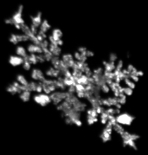

title: A Shallow Dive Into Deep Learning
url:
class: animation-fade
layout: true

<!-- This slide will serve as the base layout for all your slides -->
.bottom-bar[
  {{title}}&nbsp;&nbsp;&nbsp;&nbsp;&nbsp;&nbsp;{{url}}
]

---
# A Shallow Dive Into Deep Learning
## Kevin Beswick
## Bret Davidson

To see the speaker notes press "p"

???

https://dli-ml.lib.ncsu.edu/sumavision/

http://localhost:5000

https://distill.pub/2018/building-blocks/

Great you're seeing the speaker notes!

Here are some notes for the speakers to control the slide deck:

- c: Create a clone presentation on a new window
- p: Toggle PresenterMode
- f: Toggle Fullscreen
- t: Reset presentation timer

---

</img>

???
There's been a lot of news about deep learning and hype about what it can do.
It is really changing the world and all of our lives

---
# Computers are good at:

- Calculations
- Data storage and retrieval
- Displaying data
- Automation of routine tasks

???

Let's set the stage a little bit. There are some things that computers have traditionally been good at:
- calculations: financial software, calculating PI
- data storage and retrieval / displaying data: social networks, storing
  data in the cloud
- and automation of routine tasks: data cleanup, used to take a while to
  do manually, greatly sped up by computers. well defined rules and structure, applied
  at a large scale

We've seen these over and over again during the history of computing. These are things we've been able to do on a computer for a long time.

---
# Computers are bad at:

- Pattern recognition
- Perception
- Generalization
- Inference

???
Here are some things that computers have traditionally been worse at.
- Pattern recognition
- perception (knowing what something is)
- generalization
- and inference (making predictions).

We have to explicitly tell a computer what something is, or manually define precise steps to follow in order to achieve some goal. These are some of the areas where deep learning is helping to improve the performance of computers.

---
class:impact
# SumaVision Demo

???
https://dli-ml.lib.ncsu.edu/sumavision/

We'll start off with a demo that maybe 5-7 years ago would have been very hard to accomplish using traditional computing tools.

Hopefully everyone is familiar with Suma? Suma is an application we manage in DLI for doing space analytics. Generally the way this is done is that someone walks through the library with an IPad and observes with their own eyes what people are doing in our spaces. They manually capture the count by navigating the space and pressing a button for each person they see.

---
# SumaVision Demo 1

<video controls src="videos/sumav_1.mov" type="video/mp4" class="img-squash img-center"/>

???

Of course there would be ethical issues to consider if actually implemented this, but what if we could capture images of a space and use that to count the number of people in a space?

We built this demo to show that we can do something like this pretty easily. You can see that this was captured in Suma.

---
# Machine Learning

- “A field of computer science that gives computers the ability to learn without being explicitly programmed”
  - https://en.wikipedia.org/wiki/Machine_learning

- Term coined by Arthur Samuel, a pioneer in the field of Artificial Intelligence (AI) and computer gaming, in 1959

- Essentially, an approach that enables computers to make predictions given some data

???
BD Start
Let's formalize our understanding of machine learning a bit more.

Read the slide.

---
class:impact
# Types of Machine Learning

???
There are two broad groupings of machine learning approaches.

---
# Supervised Learning

- Inferring a function based on labeled training data
- Given a set of images that are labeled either “cat” or “dog”, train a model to predict whether unseen images are cats or dogs
- The majority of practical ML applications are supervised learning

Examples:
- Linear regression / logistic regression
- Decision trees
- Random Forests

???

Supervised learning is when we have an algorithm that learns how to make predictions based on labeled data it has access to in advance.

Examples of these are things like linear regression, logistic regression, and random forests. Most of the things you've heard about in the news or use everyday are primarily supervised learning.

If we have an algorithm and we feed it labeled images of cats and dogs, we can train it to evaluate an previously unseen, new image and classify it.

---
# Unsupervised Learning

- Inferring a function to describe hidden structure from "unlabeled" data
- Given a set of images which aren’t labeled, use a model to cluster ones with similar properties into different categories

Examples:
- Clustering: K-means, hierarchical clustering, etc.

???
The other broad category is unsupervised learning, which is trying to make sense of an unlabled data set and then making predictions.

An example of this might be classifying unlabeled textual data.

This has been a less researched area, because it's a much harder problem.

---
# Deep Learning
</img>

???
Subfield of machine learning that involves the use of deep artificial neural networks.

Loosely mimics how the human brain works with layers of neurons with connections between them.

Deep learning algorithms are neural networks, and they are a type of supervised learning. We train them with labeled data and then we make predictions on unlabeled data.

---
# Deep Learning vs. Traditional Machine Learning

* Generalizable
* More Powerful
* Domain Neutral
* Task Agnostic

???

Deep learning is generalizable and more powerful than traditional machine learning. In traditional machine learning we have to manually define features, which is time intensive and requires domain expertise. Deep learning algorithms learn features automatically. Neural networks don't need to know anything about the problem domain they are working in. In fact, they don't even know that they are operating on images. All they see are numbers.

The same deep learning algorithms can be used for different tasks. If I wanted to have an algorithm to tell me if an image is a cat or a dog, it could also tell me if something was a hot dog or a pizza.

The code doesn't need to change, only the data being used to train the network.

---
class:impact
# What is deep learning good for anyway?

???
We gave specific examples of products that deep learning is being used in, but let's generalize that a bit and talk about what kinds of problems it's good at solving.

---

# Computer Vision
- Image classification
- Object detection/localization
- Image captioning

</img>
</img>

???

Classification. Given an image of a single object, tell me what the image is.

Object detection and localization. Given an image of multiple objects, tell me what's in the image and where it is in the image (pixel coordinates). If I have a picture of a park, it will tell me where the swing is, the slide, the pond, and put boxes around them.

Captioning. Given an image, produce a natural language caption for the image. If I gave the network an image of someome playing hockey on the street, it would give me a caption like "people playing hockey in their driveway".

---
# Natural Language Processing
  - Machine translation
  - Language modeling
  - Word embedding

 </img>

???
Deep learning is also used for NLP.

Machine translation, e.g. translation language from English to French.

Language modeling. Given some text, tell me what the parts of speech are and tell me more about the structure of the text.

Word embedding.  Given a word or sentence, can you translate it into a numerical value, which we can compare against a vector of numerical values or other things that have been translated. We can use this to explore concept similarity.

---
# Audio processing
  - Speech-to-text
  - Text-to-speech

</img>

???
Digital assistant examples fall here. For example, take an audio file of a human voice and put it into text so a machine can act on it.

Text-to-Speech is done as well, primarily to improve the quality of the voice rendering, to make the voice sound more natural and expressive.

---
class:impact
# A Short History of Deep Learning

???
Deep learning is rooted in decades of mathetmatics research and based on models of how the human brain works. The ideas behind deep learning have been in development since the 1940s, but really only exploded in popularity in 2012.

---
# Why did deep learning take so long to catch on?
- Lack of data
- Lack of compute power
- Refinement of algorithms and approaches

???

- Lack of data
  - These approaches need a lot of data to be effective
  - This is why you see things like Google captchas now that ask you to identify street signs. You are annotating data when you do this!
- Lack of compute power
  - The number of calculations it takes to train deep neural networks with a lot of data is extremely large
  - GPUs, or graphical processing units, handle these calculations a lot more efficiently
  - One modern GPU will offer around a 10x speed increase over a modern multi-core CPU
- Refinement of algorithms/approaches
  - This is a much less significant reason

---
class: impact
# How do neural networks work?

???
KB Start

Let's take a look at how deep neural networks actually work.

---

# Everything is Numbers

</img>

???

The first point I want to make is that everything is numbers to a neural
network. So we're making predictions on things like images and text, but
first we need to represent these numerically. Computers already do this
behind the scenes in a lot of cases.

For black and white images, we can represent them as a matrix of numbers, where each
number represents the intensity of a particular pixel (or how light/dark
it is). For colored images, each number would be a set of 3 numbers that
represent the intensity of Red, Green, and Blue colors in a given pixel.

For text, we can express each letter as a vector that has 26 values
corresponding to each letter in the alphabet. The position of the given
letter will be 1, and everything else will be 0. As
you can see in the example, for the first letter "A", the first value is
a 1, and for the "D", the 4th value is a 1, and so on. This is called
"one-hot encoding".

---

# High Level Process

- Define a prediction problem: given x, can I predict y?
  - Example: given an image, can I predict whether it is of a cat or a dog?

- Gather training data
  - Images of cats and dogs that are labeled "cat" or "dog"

- Given this set of labeled training data, train a model that can
  make predictions given new, unseen images.

???

The general process we'll have to go through to train a neural network
is as follows:

read slide

---

# Neural Network Model

</img>

???

When input data flows through the network, and a prediction is made, we
call it the forward pass, or a feed forward network. Each neuron in a
network is learning to recognize a specific feature of the input image.
Neurons in earlier layers are learning low-level features like edges, while later
layers progress to learning higher level features, like noses, ears, tails, then heads/bodies.
At the end, it is fed through a final layer that does classification
based on what features it has most strongly detected.

---

# Neuron

</img>

???

Let's zoom in on a single neuron to see what it is doing. Remember, each neuron is
learning to recognize a different feature of the image.

As we mentioned before, the basic structure of a neural network is
modeled after the way the human brain works. I've included labels for
the corresponding part in the human neuron, as well as the mathematical
notation for how everything is represented in the neural network.

Mathematically, there are a few things going on here, but I want to just
point out a couple of important things. Several signals come in through
these connections from the previous neurons, and each connection
carries a different weight which is applied to the signal. The weights
are the values that we need to learn - they influence what features a neuron
detects.

Concretely, imagine each input to this neuron is a pixel in the image, and this neuron is looking for a cat-shaped ear
in the image. The weights for those pixels that contributes to the
shape/texture of a cat-shaped ear would be higher, and the weights for those pixels that don't
would be low. Think of the weights as either amplifying the signal of
the pixel if it contributes to the feature this neuron is looking for, or quieting the signal if it doesn't

So these values are all passed into the cell body where they are
combined, and then they are passed to an activation function.
The activation function is what controls whether a neuron fires or not, and
how strong the signal will be. Think of this like the
dimmer switch on a light - it can either be off and pass no signal, or some degree of on sending
a signal that ranges from very weak to very strong. In neural networks, there are a variety
of different activation functions we can use.

If something that contains a cat's ear is passed into this
neuron, this activation function would fire and a strong signal would be
passed to the next neuron.

---

# Training Process - Loss/Cost Function

- Measure of error between prediction and known label
- Mean Squared Error is popular, but anything that can measure error will work

</img>

???

Now that we have a network model, and we have some intuition about
how it works, how do we go about training it? We have a process for
getting a prediction on an example, which has a confidence score
associated with it. We need a measure to determine how good or bad our
prediction is, which is where a Loss Function comes in.

So rememeber, during training we are passing in a set of images where we
know what the correct label is. A loss (or cost) function tells us how far
away our network's prediction is from what we know to be the actual answer. There
are many different options for a loss function, but for a classification
problem like this, the mean squared error is a popular choice.

The function will output a large value if we are further off from the
truth, and a smaller value if we are closer.

---

# Training Process - Gradient Descent

</img>

???

So now that we have a way to measure how we're doing, we need a process
to get better. Our objective will be to try to get the cost function to
return values as small as possible for the combination of all of our
training examples, or more formally "minimize the cost function". The
values that influence this and that need to be adjusted are the weights
of the connections in our network.

Here you can see what this function tends to looks like when it is graphed in
relation to 2 of the weight values in the network. In real networks, we
are dealing with potentially hundreds of thousands to millions of weights,
but the principles in this smaller example still generally hold true.

Our goal is to get to the lowest point in this graph. But the problem is
that we can't calculate this graph in a real setting because of the sheer size
and complexity. To put this into perspective, imagine you're somewhere on a hill
in a mountain range, it is dark and you can't really see what's in front of you.
You want to get down the mountain in the most efficient way possible
(so, you want to figure out the steepest direction, and take a couple of small
steps then re-evaluate).

This is exactly what we need to do to train the neural network, the
lowest point on this graph represents specific values for all of the weights where the cost function is
outputting the lowest value. This process is a mathematical technique called
"Gradient Descent"

---

# Training Process - Backpropagation

</img>

???

So we know we need to take a step (or adjust all the weights), but how do we figure out which
direction we need to take a step and how big that step should be? Every neuron has a
different effect on the output, and we need a way to update them all at
the same time in such a way that changing one doesn't have a negative
effect on any of the others. This process is called
"backpropagation".

Does anyone remember their high school calculus class? Derivatives? The
chain rule? That is what the basis of backpropagation is. For those who
aren't familiar, taking the derivative of one value tells us how
sensitive to change it is with respect to a change in another value.

Using the chain rule, we can calculate the derivatives for every weight
in the network layer by layer starting from the end going backwards to the
beginning (hence backpropagation).

---

# Training Process - Update Weights

</img>

???

We then use this function to update the weights to their new values
using the information we got about what effect changing each weight will
have on the prediction output.

The only thing I want to point out about this is there is a term called
the "learning rate", which is a configurable value we must choose. It controls
how big of a step we take each time in gradient descent. Set it too large, and
we'll likely overshoot the lowest point and never arrive at the optimal
values  for the weights. Set it too small and it will take forever to
get to that optimal point. This requires experimentation when going
through the training process.

To get a decently trained model, we repeat this whole process over the entire training set many times.

---

# Trained Model

</img>

???
- Now that the model has been trained on a large representative dataset,
  it is very good at distinguishing between cats and dogs.
- But if you showed it a picture of a horse, it would be very confused, since it
  has never seen a horse before. It would likely report low confidence
  scores for both cat and dog
- If you needed the ability to recognize horses, you would add a third
  node to the output layer, expand your training dataset to include
  labeled pictures of horses, and retrain the model.
- There is no need to write a manual horse recognition algorithm and
  integrate it to your application, you can just retrain the
  network.

---

# Inference

</img>

???
Our model is now ready to be put into production within an application that will feed it new data.
The process of getting predictions from your model on unseen data is called inference.

Here's an example of an application where we've integrated this model.
You can take pictures on your phone and it will tell you whether the
picture is of a cat or a dog. Please don't steal my great idea.

It's important to note here that you will get varying levels of
confidence in the predictions from your model, and part of the challenge
in integrating it in an application is deciding how good is good enough. It really depends on how the prediction will be used, and should be taken into account when
deploying a model into a production application.

On another note, in our demos, we've exposed our models through an API that our applications can call. This allows for reuse of the capabilities of the models. For instance, if several applications need to do people counting like in our SumaVision demo, they can all use the exact same trained model to do that.

---
# Types of neural networks

- Convolutional Neural Network (CNN)
- Recurrent Neural Network (RNN)
- Long/Short Term Memory (LSTM)
- Generative Adversarial Network (GAN)

http://www.asimovinstitute.org/neural-network-zoo/

???
In our example, we've shown you a 'vanilla neural network', or by its
cooler name: multilayer perceptron.

There are dozens of neural networks architectures, each having its own
strengths. Most work same in principle, but specifics are different

- When operating on images, we use convolutional neural networks
  - Learns filters to detect certain things in images (ie, features)
- When operating on text or other data with a temporal or sequential relationship, we use
  recurrent neural networks
  - There are variations on these too, like LSTM which adds a memory
    component so the network can recall things that happened earlier
    while processing
- If you've ever seen an example of a neural network trying to draw an
  image, it may have used a generative adversarial network to achieve
  that

---
class:impact
# How do neural networks learn?

???
BD Start
Now that we have an understanding of how neural networks work, we've prepared a demo that will help us understand how neural networks learn and how a model performs at different stages of development.

---
background-image: url(images/mariokart.jpg)

???
Self-driving Mario Kart! Why did we think this would be a good example?

- needed a way to create a large amount of labeled input data quickly
- visualize the performance of the model using different sizes of data sets
- seemed better than putting Kevin's son Elliott on a self driving tractor

---
# How do we do this?

- Model is trained using inputs:
  - Screenshots of the game taken at prescribed intervals (.2 seconds)
  - Controller input (joystick angle and which buttons are pressed)

- Predictions are made:
  - Given NEW, untrained screenshot, generate NEW joystick inputs

???
Created a deep learning model that would create a self driving mario Kart. We wrote a program that took a screenshot of the game every 0.2 seconds, while at the same time recording the controller input.

Predictions are made, given NEW, untrained screenshots, generate NEW joystick inputs. We also wrote code to deliver those joystick inputs to the game autmatically.

---

</img>

???
The model we used was taken from a seminal paper by researchers at NVIDIA, called "End to end learning for self driving cars". This model was developed as an example of how self driving cars work, but it isn’t complete or what you would use to drive your car.

It is however good enough to use for Mario Kart. The point of this image isn't to necessarily understand the convolutional neural network, but to understand the enormous number of connections it creates. This one model will create 27 million connections and 250 parameters, aa incomprehensiblly large data structure.

https://arxiv.org/abs/1604.07316

---
class:impact
# CNNKart Demo

---
<video controls src="videos/1.mov" type="video/mp4" class="img-squash img-center"/>

???
This is an early stage demo trained on a single lap around the track. It hasn't learned much yet, it's not turning.

---
<video controls src="videos/2.mov" type="video/mp4" class="img-squash img-center"/>

???
This example is a model that has been trained on 3 laps around the track. You can see it can now do basic turns, but it can't recover from errors.

A few notes on how this is working. You are seeing the prediction part of deep learning. We are taking rapid screenshots of the game, passing the image (as a multi-dimensional array of numbers) to our model, getting a prediction (controller input), and then sending that input into MarioKart.

The window on the right is showing the input that is being sent. Notice how quickly the predictions are being made, every line in the terminal output is a prediction.

---
<video controls src="videos/3.mov" type="video/mp4" class="img-squash img-center"/>

???
~15 mins of play

This example performs much better, and can do things like error recovery. This one can actually finish a race.

---
class:impact
# Why Build Our Own?
???
One question we often get is why do we need to do our own machine learning?

It's not always required that we build our models entirely from scratch. We will often take a known model, tweak it and train it on our own data.

One technique is to use "transfer learning: where we can remove the output layer from an existing model and add our own. The lower layers will learn more abstract concepts and higher layers will learn more concreate concepts. So we can take advantage of the abstract features of the existing model and improved training time, but we still have the benefit of adding our own layers and training on our own data.

What you've seen today has been a combination of using API services, using known models directly, and using transfer learning techniques to take known models and extend them for library use.

---
class: impact
# Opportunities in Libraries

???
KB Start

Major part of our exploration is to identify some of the opportunities in libraries.

We've found three major categories.

---
class:impact
# New functionality

???

Integrating deep learning into our own applications to get some new functionality we couldn't get before like improving the way we auto generate metadata, how we handle chat interactions, and improved search capabilities. Example Deep Catalog.

---
class: impact
# Deep Catalog Demo

???

Here's a demo application we've developed to show how we could leverage
deep learning to get a head start in metadata generation for newly
digitized or created materials, and how we could improve discovery
without any human generated metadata.

It also highlights the importance of systems integrations in supporting usage of machine learning. For each part of this example, we're using a different approach
in how we're generating the data. These approaches used in deep learning pipelines can create new capabilities in our services.

---

# WolfTales

<video controls src="http://siskel.lib.ncsu.edu/SCRC/mc00581-wt-peele-20151030/mc00581-wt-peele-20151030.mp4" type="video/mp4" class="img-sqash img-center" />

???

First, lets look at a few seconds of this Wolf Tales video. I want you
to pay attention to some of the key things he mentions.

---

# Audio/Video Processing

<video controls src="videos/deep_catalog_1_720.mov" type="video/mp4" class="img-squash img-center"/>

???

Now lets look at this new catalog application. I'm going to ingest this
video and only give it a title and author.

Remember what Danny was talking about in the video? Harrelson Hall?
Let's try searching for that. He also mentioned he used to be a physics
major right? Let's try that one too. He said that he ended up a liberal
arts major though. You can see where I'm going with this.

So what happened here? When I uploaded the video, in the background, the
audio was extracted automatically and it was run through a speech to
text model. In this example the full text itself was indexed so that we
were able to search for terms that appear in there.

But now that we have a textual transcription, imagine what else we can do.
We can definitely provide it directly to users and automatically enable
captioning on the video. We can do further analysis on that text, and
generate recommendations for appropriate subject headings, or at least
get the key terms or create a summary in an automated way.

This was using the Google Speech API. We chose to use that because it
does a way better job that a model we ran locally could do, and speech
to text is a fairly generic problem, so we have no reason to customize
it.

---
# Newspapers

<video controls src="videos/deep_catalog_3_720.mov" type="video/mp4" class="img-squash img-center"/>

???

Here's one more. Remember when we mentioned transfer learning before? This one uses the same model architecture as
SumaVision, but we took off the later layers and retrained on new data
we collected. This one finds the location of headlines and images in
newspapers. We can then run further processing to find out what is in
the image, and to OCR the headlines. We can then offer more fine grained
search results based on the articles in a newspaper, and the ability to
jump to that specific article automatically since we know what page its
on in the newspaper and where on the page it is.

---

class:impact
# Supporting Researchers

???
The second is supporting researchers through deep learning consultations and research sprints. We can help bootstrap researchers looking to get started with applying deep learning techniques to their research projects. Example snowflake research.

---
# Snowflake Classification

    </img>
    </img>
    </img>

???

Dr. Matthew Miller from the dept of marine, earth, and atmospheric sciences, contacted the libraries looking for machine learning support. They have an extremely large dataset of over 1 million snowflake images. These images are taken by one of only ten cameras that are doing this capture. Have used a number of "traditional" machine learning techniques to attempt to classify degrees of "riming" on snowflakes, that is, how large or small the clusters of ice are. We are working with them to develop a proof of concept model to explore the potential for current deep learning computer vision techniques to improve on their results.

This has also been an opportunity to explore the viability of providing this kind of service to researchers. Is it useful for them? Can we scale this kind of support?

---
class:impact
# Cultural Heritage Ecosystem

???
Third is developing the ecosystem around deep learning use, e.g. data annotation, data distribution, etc. In general, improving use of these approaches among cultural heritage institutions.

---
# Data Annotation and Sharing
- current tools for data annotation are limited
- opportunities for defining best practices for sharing models and approaches

???

Through our experimentation, we've learned that current tools for data annotation are extremely limited in terms of their ease of use and speed of use. We've prototyped new designs for tools in this area that speed up the process, and also allow for crowdsourcing of this process.

As earlier adopters, we're also in the position to help define best practices and approaches for sharing models and data for reuse by other cultural heritage institutions. For example, if we pursued a production model to detect headlines and images in newspapers, this would probably be useful to other libraries. How can we share data for the purposes of reuse? How can we make it easy for other institutions to get their own models up and running? How can we make it easy for them to contribute new data to the model?

---
# Ethics

- data is often the source of bias in this technology
- identify ways to create more representative data sets
- expose to the user that we are using this technology
- give them the option to turn it off
- give them the option to provide feedback

???
We wanted to cap off saying a bit about algorithmic bias in deep learning. We hope we've convinced you through this presentation that it's the data that are the really important piece of introducing bias into models.

We need to identify ways to create better representative data sets.

We should explore  ways to expose to the user that we are using deep learing, give them the option to turn it off, and give them the option to give feedback, potentially with reinforcement learning systems.

---
# Deep Learning Research

Olah, et al., "The Building Blocks of Interpretability", Distill, 2018.

https://distill.pub/2018/building-blocks/

???
Example of work being done to help expose the way neural networks make decisions and train themselves.

---
class:impact
# Thanks!
